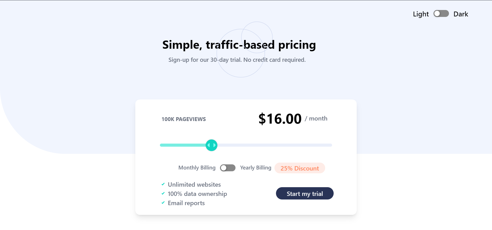
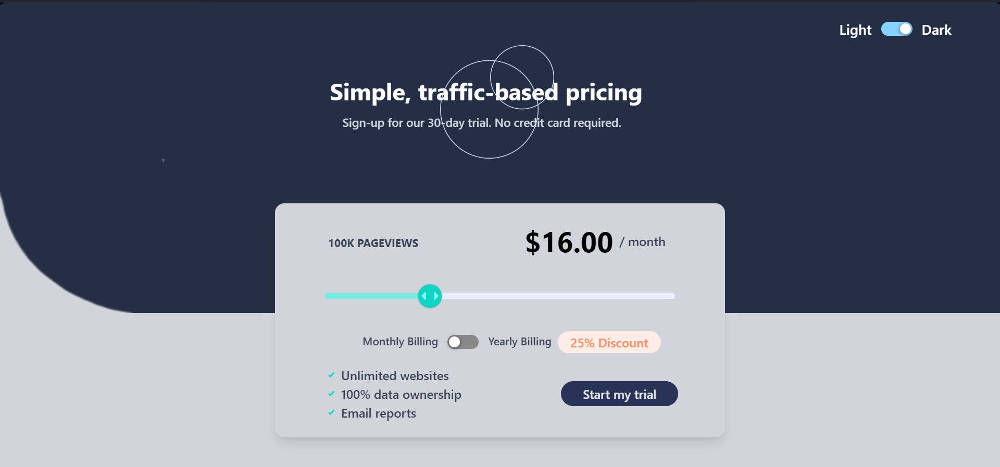

# Frontend Mentor - Interactive pricing component solution (Punya Jain)

This is a solution to the [Interactive pricing component challenge on Frontend Mentor](https://www.frontendmentor.io/challenges/interactive-pricing-component-t0m8PIyY8).

## Table of contents

- Overview
  - Interactive pricing component challenge on Frontend Mentor (Invsto_assignment)
  - Deployed Link of the project - https://invsto-assignment-9b49c.web.app/ (Created by me as per Frontend  mentor challenge).

- My process
  - Tech Stack I used to build this project
    - Initialise react app by - create-react-app 
    - language - Javascript
    - Library used for frontend (user interface) - React
    - Routes - react-router-dom
    - Styling - Tailwind CSS
    - Global State management - Redux toolkit 
    - Connecting react and redux - react-redux package
    - Deploy Platform - Firebase

  - Useful resources
    - https://tailwindcss.com/docs/guides/create-react-app
    - https://www.npmjs.com/package/@reduxjs/toolkit
    - https://colorhunt.co/

- Author
    - PUNYA JAIN 
- Github repository of the challenge (Invsto Assignment)
    - https://github.com/PunyaJain24/Invsto-assignment-by-Frontend-Mentor


## Overview

### The challenge

Users should be able to:

- View the optimal layout for the app depending on their device's screen size
- Enabled theme in the project - User can view the webpage based on the theme he/she likes (Light OR Dark)
- Use the slider and toggle to see prices for different page view numbers
- Click on the button "Start free trial" to see the CONFETTI effect (additionally implemented by me).

### Screenshot





### Links

- Solution URL: (https://github.com/PunyaJain24/Invsto-assignment-by-Frontend-Mentor)
- Live Site URL: (https://invsto-assignment-9b49c.web.app/)

### What I learned

```html
<div className="mx-16 my-9">
                    <input 
                        className="w-full range-slider" 
                        type="range" 
                        step="4" 
                        min="8" 
                        max="36" 
                        value={data} 
                        onChange={(e) => setData(e.target.value)}
                        style={{ 
                            background: `linear-gradient(90deg, hsl(174, 77%, 70%) ${(data - 8) * (100 / (36 - 8))}%, hsl(224, 65%, 95%) ${(data - 8) * (100 / (36 - 8))}%)`
                        }}
                    />
                </div>
```
```html
{window.innerWidth < 500 && <div className="flex ml-[94px] mt-6 my-8">
                        <div className="text-4xl text-black font-bold">
                            ${toggle ? (data*0.75)*12 : data}.00
                        </div>
                        <div style={theme ? {color: "rgb(55,65,81)"} : {color: "rgb(107 114 128)"}} 
                        className="px-2 py-2 text-gray-500 font-medium">
                            / {toggle ? "year " : "month"}
                        </div>
                    </div>}
```
```js
import { createSlice } from "@reduxjs/toolkit";

const themeSlice = createSlice({
    name: "theme",
    initialState: {
        dark : false,
    },
    reducers: {
        changeTheme : (state,action) => {
            state.dark = (action.payload);
        },
    }
});

export const {changeTheme} = themeSlice.actions;

export default themeSlice.reducer;
```

### Continued development

In my future projects, whether as an intern or a full-time team member at Invsto, I am committed to leveraging diverse tech stacks to enhance my current knowledge and deliver outstanding results. My goal is to contribute my best efforts to achieve the highest outcomes for the team and the company.

## Author

- Website - [Punya Jain](https://punya-jain-90368.web.app/)
- Frontend Mentor - [@PunyaJain24](https://www.frontendmentor.io/profile/PunyaJain24)
- LinkedIn - [Punya Jain](https://www.linkedin.com/in/punya-jain-1b39981b6/)


## Acknowledgments

TI took this challenge for myself and if I talk about my helping hand throughout project is the GOOGLE. If I got stuck in any code or got some un expected result. I usually googled it and search for that topic to learn it. For instance, I got stuck stuck in building the slider where I have to give color to the left part of the slider but it doesn't work in my code. At that, I usually googled it and try to learn about the implementation of slider. This is one example and every time whenever I got stuck, I simply goggled it and learned it.